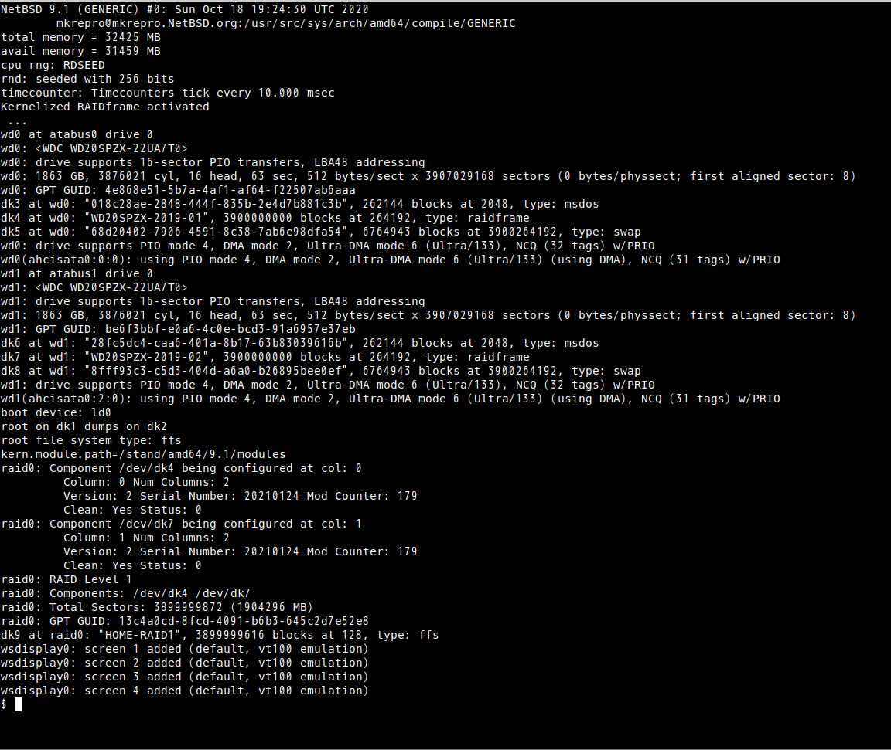

# インフラ小咄<br>このサーバって物理?仮想?<br>lsコマンドで探ってみる


#### コマンドに慣れるため2つの基本コマンドだけでサーバの中を探検してみます


## **Unixコマンド (歴史から話したいひとたちであった:-)**
- Unixは開発者たちが自分たちで使いやすいように作ってきたOSです。 今でこそ最初からGUI操作できて当たり前のような雰囲気ですが、 1980年代なかばくらいまではコマンド操作(CUI)が普通でした。 80年代半ば以降GUIも普及してきましたが、 安くなったとはいえUnixマシンは百万円単位の買い物なので、 複数人で一台のマシンを共有していました。 だから、GUIを使えるのはコンピュータの前に陣取った一だけ:-)で、 その他の人は遠隔で使ったものです (どうやったら今の人に実感してもらえるのかなぁ?)
  
 


  (脚注) 遠隔といってもコンソールケーブルでの接続です(<- 説明が難しい...)。 他の低価格なGUIできるUnix端末からTCP/IPでサーバ機へリモート接続もしました

<br>
<br>

---

<br>
<br>

## **Unixコマンドって何個くらいあるの?**

- う〜ん… **使えるとなまら便利**というものは数十個かなぁ? e.g. ファイルを探すとか、ソート・計算・成績をつけるとか…
- 定番のコマンドだけ使えるだけでも随分べんりだよ〜 (ぱぱっと組合せを考えらられるようになれば) **GUIより仕事10倍速まちがいなし**
- Unix上での生活で普段よく使うコマンド〜システム管理のものまでいろいろあるので、 どこからどこまで数えるかで随分かわります。 またOS標準配布物に加えてサードパーティ製コマンドを追加すればさらに増えます
- 例: 現在時刻
```unix
% date
Tue Jan  1 12:34:56 JST 2022
```
- 例: OSの情報を表示
```unix
% cat /etc/os-release 
PRETTY_NAME="Debian GNU/Linux 10 (buster)"
NAME="Debian GNU/Linux"
VERSION_ID="10"
... 省略 ...
```
(脚注) ちなみに、自分のDebian 10で数えたら3652個となり、めまい...

<br>
<br>

---

<br>
<br>

## **番外編: Unixらしい使い方**

- サーバの操作では、ここまで必要でないので軽く紹介するだけ(そのうちね)
例: ちょっと、すべての課題の点数を足して成績順で表示してみたい
```unix
% cd 授業/os-2021/
% cat 出席.csv 中間.csv 最終課題.csv | awk '{sum[$1] += $2}' | sort -n -k 2
```
- catはファイルを表示し、sortは文字どおりでソートするコマンド(**1コマンド1機能**)
awk(**プログラミング言語AWK**)は少し凝ったことをしたい時に必須です。 ここではハッシュテーブル(キーは学籍番号)で成績を積算するために使っています
- |(**パイプ**,縦棒,ぼっこ)は**左から右にデータの流れをつなぐ特別な呪文**で、 **Unix環境を特徴づけている呪文**です
- **どのファイルも「学籍番号 空白 点数」**というフォーマットです(**重要**)

(脚注) 実際、こうやって成績をつけてます:-) コマンドでいろいろ操作して、よさそうな理屈を探します。 いい感じになったら、その文字列をコピー&ペーストしてスクリプト(ファイル)に保存します。 これで毎回おなじ理屈で成績がつけられるね！ **成績 as a Code**:-)

<br>
<br>

---

<br>
<br>

# lsコマンド<br>〜たんけんUnix〜

## **/の下を見てみよう (普通のサーバ)**

`ls /`を実行してみると次のように表示されます。 `/`は一番上の階層(Windowsで言うところの`C:\`相当)です。 この英単語の省略形が何?というのは慣れるしかありませんが、 昔から`etc`ディレクトリ(etc=エトセトラ、Windowsではフォルダ)以下に設定ファイル群を置く習わしです。 また、 `dev`以下にはデバイスの情報、 `proc`以下にはプロセスファイルシステムというOSの情報がファイルとして見えるという特殊なファイル群があります

```Unix
bin   docker  initrd.img      lib64      mnt    pub   sbin  sys  var          vol
boot  etc     initrd.img.old  lost+found  opt    root  snap  tmp  vmlinuz
dev   home    lib          media      proc    run   srv   usr  vmlinuz.old
```

<br>
<br>

---

<br>
<br>

## **/devの下を見てみると? (普通のサーバ)**

`ls`と`cat`だけでも、いろいろ分かるよねというデモを行います

`ls /dev`すると、たくさん(この例では160個)出るね、 これが普通にインストールした状態のサーバ。 これだけでは物理か仮想かは分からないけれどもね

```Unix
autofs           hugepages           pts       tty1   tty28  tty46  tty7     vcsa2
block            initctl             random    tty10  tty29  tty47  tty8     vcsa3
bsg              input               rfkill    tty11  tty3   tty48  tty9     vcsa4
btrfs-control    ipmi0               rtc       tty12  tty30  tty49  ttyS0    vcsa5
bus              kmsg                rtc0      tty13  tty31  tty5   ttyS1    vcsa6
cdrom            kvm                 sda       tty14  tty32  tty50  ttyS2    vcsa7
char             log                 sda1      tty15  tty33  tty51  ttyS3    vcsu
console          loop-control        sda2      tty16  tty34  tty52  uhid     vcsu1
     ... 略 ...
fb0              null                stderr    tty23  tty41  tty6   vcs5     vga_arbiter
fd               port                stdin     tty24  tty42  tty60  vcs6     vhci
full             ppp                 stdout    tty25  tty43  tty61  vcs7     vhost-net
     ... 略 ...
```

<br>
<br>

---

<br>
<br>

## **/devの下を見てみると? (コンテナ)**

`ls /dev`すると、コンテナの場合すごく表示されるものが少ないのが分かるね (これはdebian:11.1公式イメージの例)。 これはコンテナが**制限された環境**を作り出すためのものだから少ないのが当然という話

```Unix
console  fd    mqueue  ptmx  random  stderr  stdout  urandom
core     full  null    pts   shm     stdin   tty     zero
```

