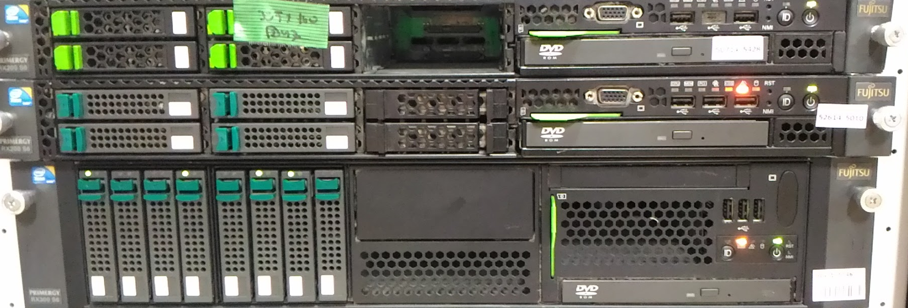
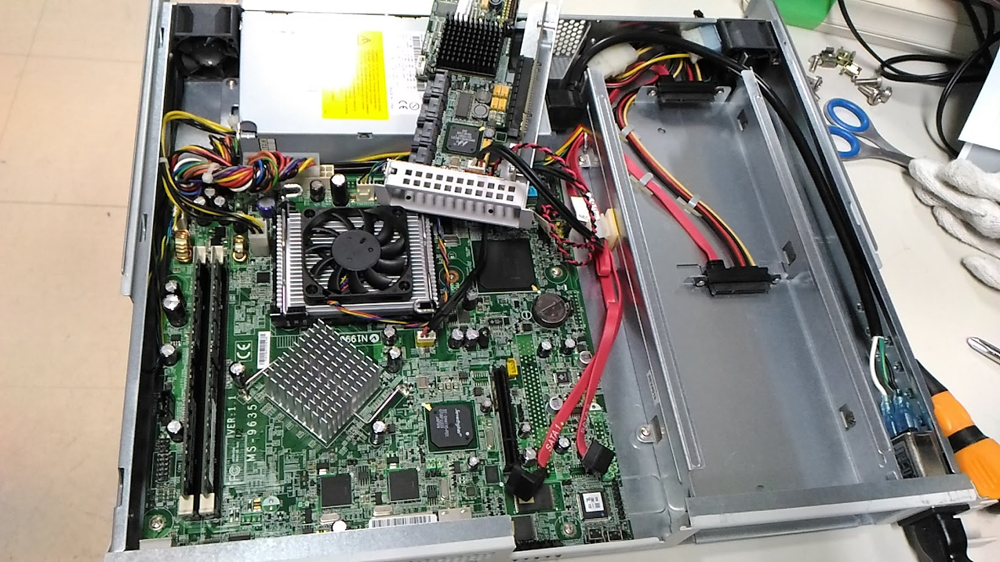
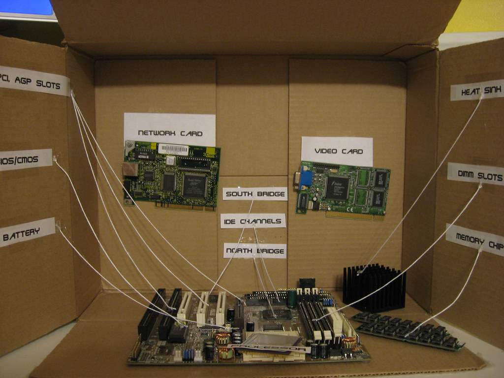
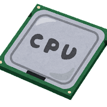
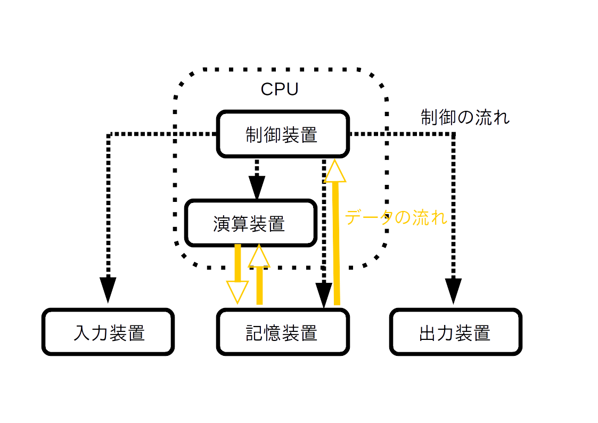
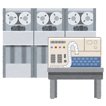
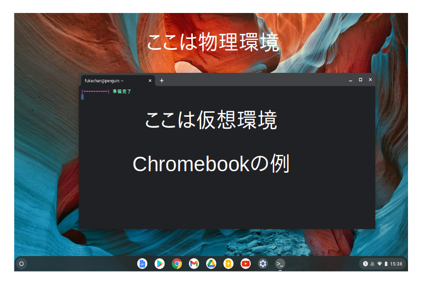

# そもそもサーバーって何？

## **サーバーってなんですか？**
- ウエイターさんだよ
- え？
- つまり
  - お客がクライアント、たとえばWWWブラウザ
  - サービス(service)するのがサーバ(server)だから、ウエイターさんがサーバってことや
  
 

  (脚注) ブラウザを使っている人間もお客さんだけど、 コンピュータの動作の話をしてるから、 人間のところはちょっと忘れておいておくれ:-)

 
 

---

 
 

## **サーバって物理なの?ソフトなの?**

- サーバの実態って何なんですか?
- じつは文脈依存なんだな
- ?
- 強力なPC(ハードウエア)のこともサーバと言うし、 そのPCの上で動かしているソフトウエア(つまり機能)のことをサーバと言うね。 この辺は慣れてもらうしかないけれど、 インフラの設備を作るのでないなら、 たいていはソフトウエアの話をしているんだとおもうよ。 たとえばWWWサーバと言えば、 たいてい、WWWの機能を提供するソフトウエア(例: apache, nginx)が話題で、 そのソフトウエアを動かすハードウエアの話をしているわけではない

  
  
  

 
 

---

 
 

## **物理サーバって楽しいですか?**

- 楽しいよ、楽しい人には
- って…
- まぁ好き好きだから(w)
- 最近の人は、ネットワークケーブル(有線)すらイヤな顔をするけど、 ブラウザだって、なんとなく動いているわけではないんよ。 インターネットの裏側(実体)では、 物理のサーバが何百万台も動いているんだし、 それらを誰かが設計・構築・運用しているわけよ。 最近は、 こういうインフラまわりに興味をもつ人が少ないから、 逆に大歓迎されるね〜

 
 

---

 
 

## **仮想サーバって単語がありますよね?**

- あるねぇ
- それって何?「仮想WWWサーバ」なんて単語もある?
- いや、それはない
- お、おう
- 「仮想サーバ」は「物理サーバ」の反対語だよね。
- 反対?
- 物理(ハードウエア)の反対は実体が無いということだからソフトウエアだよね。 仮想サーバ=ソフトウエアサーバってことだけど、 WWWソフトウエアのサーバじゃないよ。 物理サーバ=コンピュータのハードウエアをソフトウエアで動かすのが仮想サーバ

 
 

---

 
 

 ## **コンテナっていう単語もありますよね?**

- あるねぇ
- それって何?「仮想サーバ」と何がちがうんでしょう?
- とりあえずは、コンテナと呼ばれる「仮想サーバ」の一種でOKだよ。 いわゆる仮想サーバとは使う技術も目的も違うのだけれど、 細かい区別より、まずはサーバなるものに慣れたほうがいいとおもうんだよね。 ユーザとして使う分には区別なんてつかないしね。 開発しようとする際には区別を勉強する必要があるだろうけど

(脚注) もうすこし詳しいところは、[OSの授業](https://lectures.fml.org/os/)って思ったけど、 そこまで出来てなかったわ:-)

 
 

---

 
 

## **少しコンピュータの話をしないとだね**

- コンピュータの心臓部はCPUというハードウエアで、 CPUは数字で与えられる命令とデータを処理している

- ほい
- 古代では、穴が開いてる紙テープで表現してたアレやな。 あの紙テープを読んで解釈するハードウエアがCPU
  

- ほい
- でも、しょせん数字を解釈するだけでしょ? 数字を解釈できるソフトウエアを書いたらCPUと区別できないじゃん。 真似っこができるじゃん?(ただし処理速度が低いけど;-) それが仮想サーバの心臓部
  
(脚注) もうすこし詳しいところは、[OSの授業](https://lectures.fml.org/os/)をみておくれでないかね

 
 

---

 
 

## **え?仮想と物理の違いって?**

- CPUを真似るソフトウエアがあると…
- うん
- そのソフトウエアがあれば十分なので、 仮想と物理を区別する必要があったの?
- 速度の問題だね。 CPUというハードウエアはソフトウエアより速いから。 かつてはコンピュータ=ハードウエアを占有する形態が普通だったけれど、 (身の回りにあるPC上の) 仮想サーバが物理サーバと同じくらい速くて利用が現実味をおびたのは2000年代後半の話

 
 

---

 
 

## **いま使っているPCが仮想かもしれないのかな?**

- いま使っているPCが仮想か物理か区別できますか?
- もちろん目の前で使っているPCは物理だとおもうけどね:-) でも、その上で仮想PCを起動していることもあるね。いずれにせよ、おおむね出来ると思うよ
- ほほぉ
- それには２、３コマンドを実行する必要があるね。 いよいよ Unix コマンドに親しんでみようじゃないかね (おぉ、やっと本題に入った?:-)

